# 📱 FIAP: Portal Acadêmico (Mobile) - CheckPoint 1 🚀

## 📑 Índice

1. [📌 Sobre o Projeto](#-sobre-o-projeto)
2. [👥 Integrantes](#-integrantes)
3. [🛠️ Tecnologias Utilizadas](#️-tecnologias-utilizadas)
4. [⚙️ Como Rodar o Projeto](#️-como-rodar-o-projeto)
5. [🎬 Demonstração](#-demonstração)
6. [🧠 Decisões Técnicas](#-decisões-técnicas)
7. [🔮 Próximos Passos](#-próximos-passos)


## 📌 Sobre o Projeto

O **FIAP: Portal Acadêmico** consiste em um aplicativo mobile desenvolvido utilizando **React Native com Expo**, cujo objetivo é **modernizar e aprimorar a experiência do aplicativo acadêmico atualmente utilizado pela FIAP**.

Diante do crescimento institucional, refletido no aumento de alunos, disciplinas e demandas acadêmicas, surgem desafios relacionados à usabilidade e eficiência dos sistemas existentes.

### ⚠️ Problemas identificados

* 🔄 **Falta de centralização:** necessidade de acessar múltiplas plataformas (website, teams etc.) para obter informações acadêmicas.
* ⏳ **Experiência fragmentada:** dificuldade em acompanhar prazos e atividades.
* 🏫 **Baixa integração com o campus:** ausência de funcionalidades que atendam necessidades cotidianas (ex.: kitchenet).
* 📱 **Interface desatualizada:** design pouco intuitivo e não otimizado para mobile.

### 🎯 Importância da solução

O aplicativo propõe atuar como um **hub central de organização acadêmica**, promovendo:

* 📅 **Maior previsibilidade** na rotina do aluno
* 🧩 **Autonomia na gestão acadêmica**
* ⚡ **Otimização da experiência no campus**
* 🎨 **Interface moderna e intuitiva**

### ✅ Funcionalidades desta versão

* 📚 Listagem de disciplinas
* 📝 Visualização de atividades e entregas
* 🍔 Sistema de pedidos na kitchenet
* 🧭 Navegação entre telas com tabs

> ℹ️ Observação: os dados utilizados são **mockados**.


## 👥 Integrantes

* Alice Santos Bulhões: RM554499
* Eduardo Oliveira Cardoso Madid: RM556349
* Nicolas Haubricht Hainfellner: RM556259
* Lucas Henzo Ide Yuki: RM554865
* Guilherme da Cunha Melo: RM555310


## 🛠️ Tecnologias Utilizadas

<p align="center">
  
  
  
  
  
  
</p>

### 📚 Principais bibliotecas

* 📍 **Expo Router**: Navegação baseada em arquivos
* 📅 **react-native-calendars**: Componente de calendário
* 🖼️ **expo-image-picker**: Seleção de imagens
* 🔄 **react-native-swiper**: Carrossel de conteúdo
* 🎨 **@expo/vector-icons (Ionicons)**: Ícones


## ⚙️ Como Rodar o Projeto

### 📋 Pré-requisitos

* Node.js (LTS)
* npm (ou yarn/pnpm)
* Expo CLI (via `npx`)
* Expo Go (dispositivo físico ou emulador)

### ▶️ Execução

```bash
# 1. Clonar o repositório
git clone https://github.com/L-A-N-E/FIAP-APP-CheckPoint-1-Mobile-Development

# 2. Acessar o diretório
cd FIAP-APP-CheckPoint-1-Mobile-Development

# 3. Instalar dependências
npm install

# 4. Iniciar o projeto
npx expo start
```

### 📱 Execução no dispositivo

* 📲 **Celular:** utilizar o Expo Go para leitura do QR Code (precisa estar na mesma rede)
* 💻 **Emulador:** utilizar atalhos do Expo (`a` ou `i`)


## 🎬 Demonstração

### 🖼️ Prints das Telas

* 🏠 Home

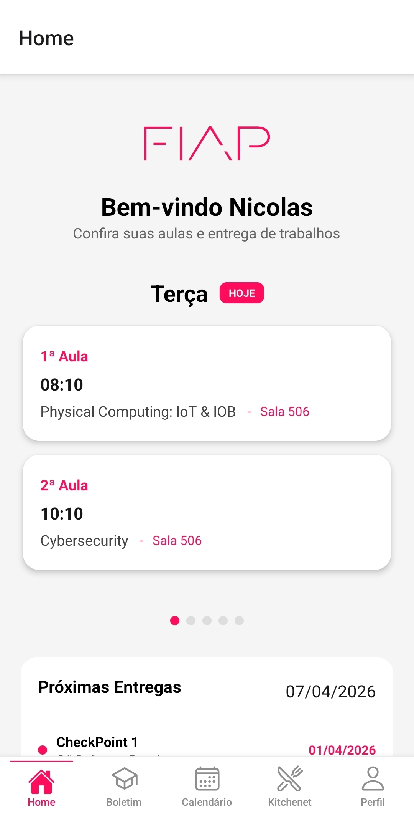

* 📊 Boletim

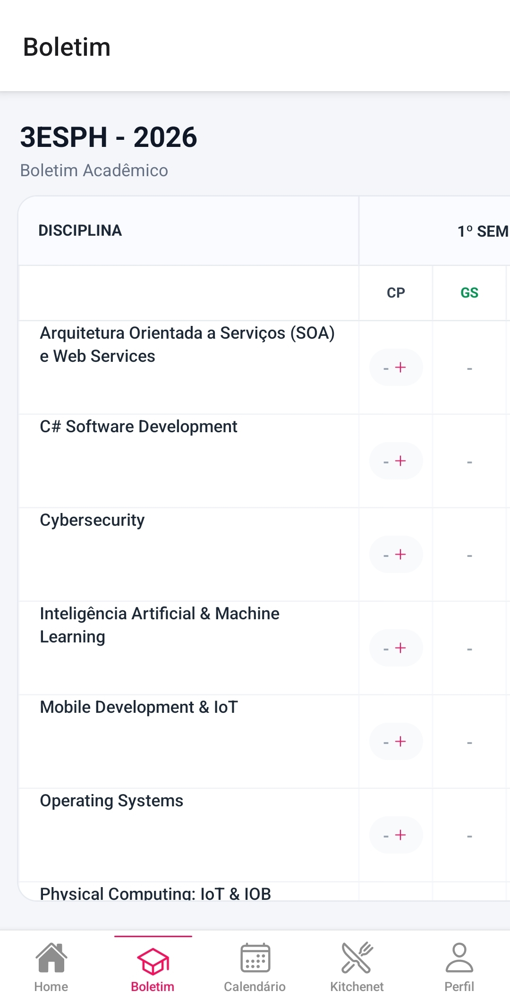
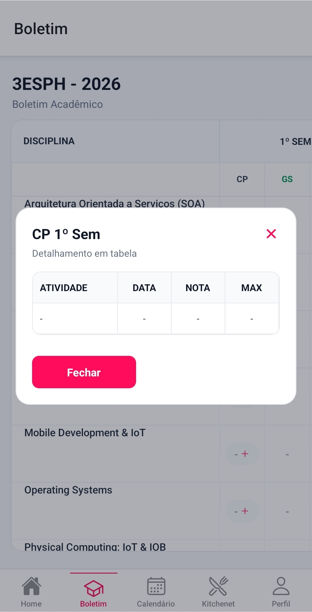
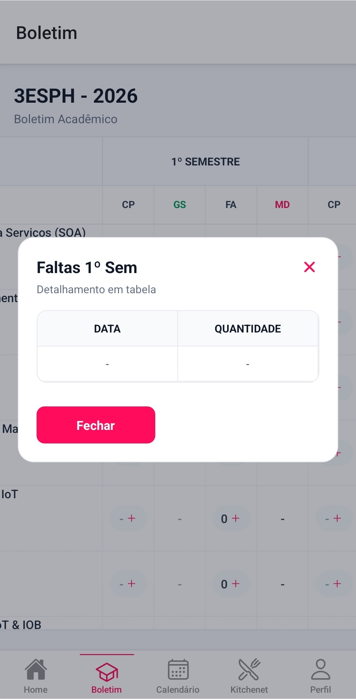

* 📅 Calendário

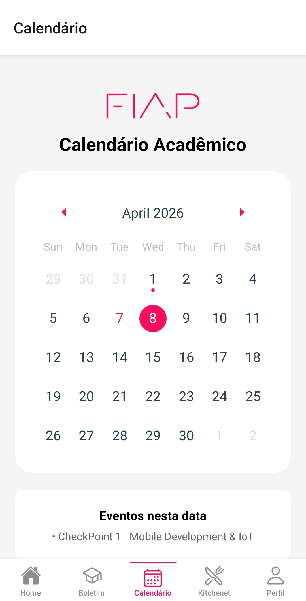

* 🍔 Kitchenet

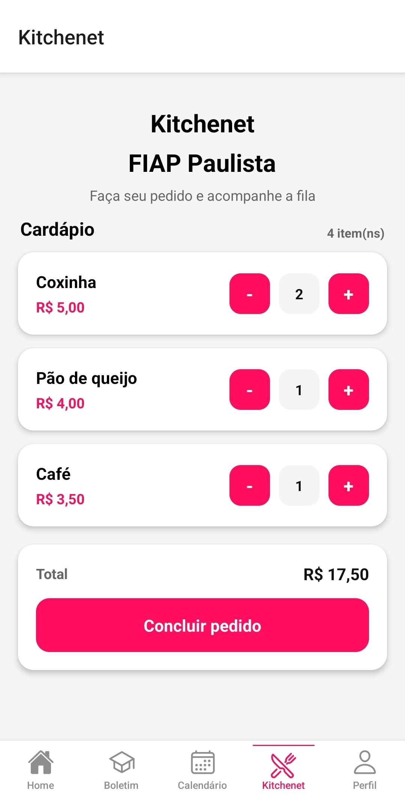
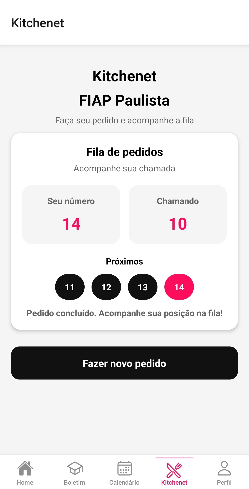


* 👤 Perfil

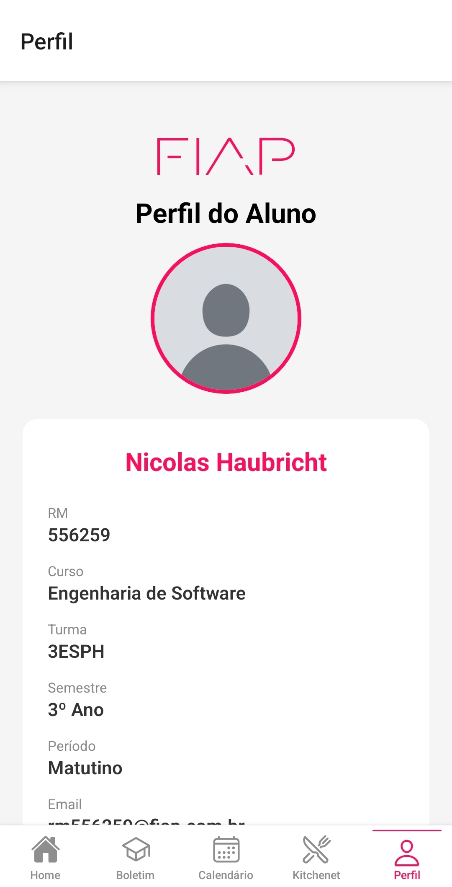
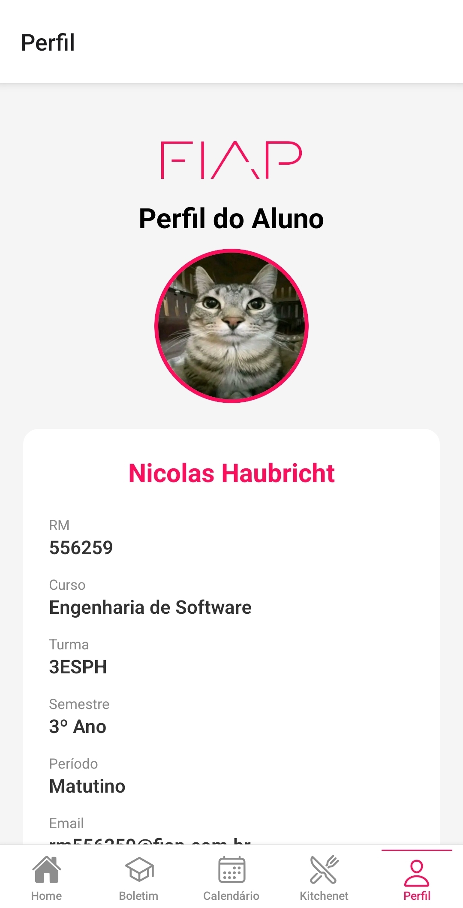


### 🎥 GIF

* 🏠 Home


* 📊 Boletim


* 📅 Calendário

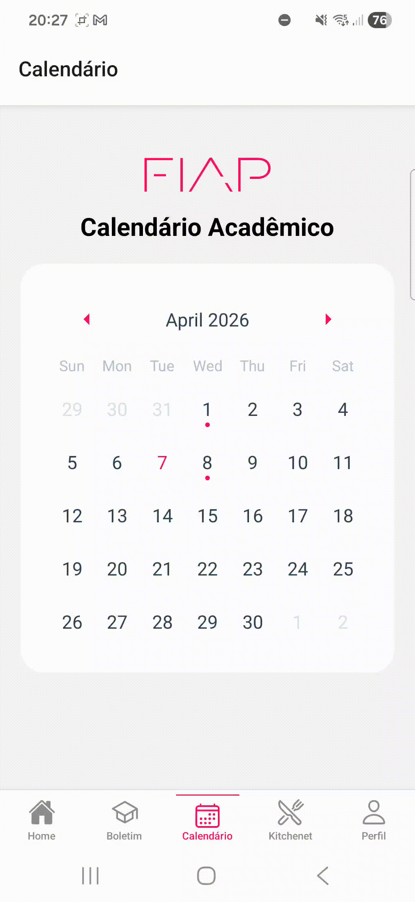

* 🍔 Kitchenet

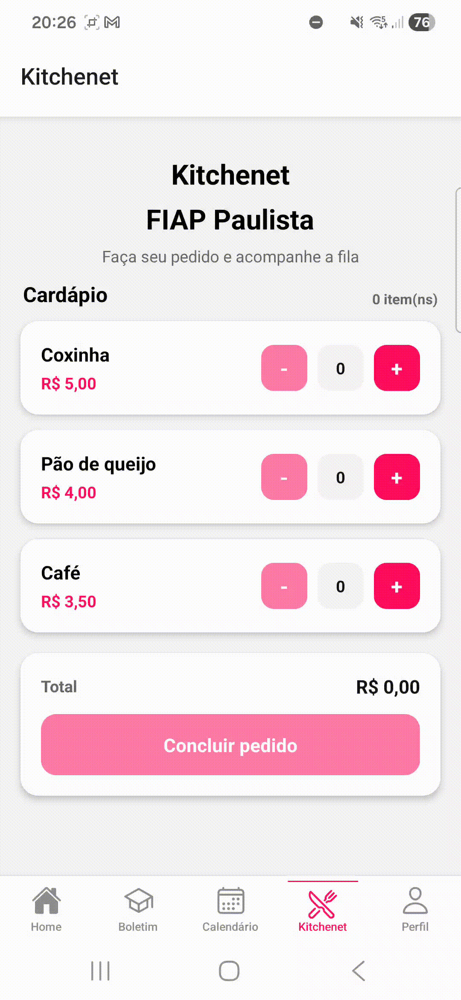

* 👤 Perfil


## 🧠 Decisões Técnicas

Esta seção detalha **as escolhas arquiteturais, bibliotecas e padrões utilizados**, com foco em **escalabilidade, manutenibilidade e experiência do usuário**.


### 📂 Estrutura do Projeto

O projeto adota o padrão **file-based routing** por meio do **Expo Router**, substituindo a abordagem tradicional baseada em configuração manual de rotas.

#### 🔎 Justificativa Técnica

A decisão de utilizar esse modelo foi baseada nos seguintes fatores:

* 🧩 **Redução de complexidade estrutural:**
  Em arquiteturas tradicionais com `React Navigation`, é necessário configurar manualmente stacks, tabs e rotas. O Expo Router elimina essa necessidade ao mapear automaticamente arquivos para rotas.

* 📈 **Escalabilidade natural:**
  A adição de novas telas não exige alterações em arquivos centrais de navegação, reduzindo risco de regressões.

* 🧠 **Melhor organização cognitiva:**
  A estrutura baseada em diretórios reflete diretamente a navegação do app, facilitando entendimento por novos desenvolvedores.

* ⚙️ **Menor boilerplate:**
  Reduz significativamente código repetitivo relacionado à navegação.

📌 **Trade-off considerado:**
Menor controle manual sobre navegação complexa (ex.: fluxos altamente customizados), porém aceitável para o escopo do projeto.


### 📚 Bibliotecas Utilizadas

#### 🔹 Expo (Ambiente Base)

* **Problema resolvido:** complexidade de configuração do ambiente React Native puro.
* **Justificativa técnica:**

  * 🔧 Elimina necessidade de configuração manual de Android/iOS nativo
  * ⚡ Permite prototipação rápida
  * 📱 Integração direta com APIs nativas (camera, galeria, sensores)

📌 **Decisão estratégica:** priorizar produtividade e entrega funcional no contexto acadêmico.


#### 🔹 Expo Router

* **Problema resolvido:** complexidade de navegação e manutenção de rotas.
* **Justificativa técnica aprofundada:**

  * 📁 **Convention over configuration:**
    Reduz erros humanos ao evitar configurações manuais extensas.

  * 🔄 **Baixo acoplamento:**
    Cada tela é independente, reduzindo impacto de mudanças.

  * 🧪 **Facilidade de testes e manutenção:**
    Telas podem ser testadas isoladamente.

📌 **Impacto arquitetural:** melhora a **manutenibilidade** e reduz custo de evolução do sistema.


#### 🔹 react-native-calendars

* **Problema resolvido:** alta complexidade na implementação de calendários.

* **Justificativa técnica:**

  * 📅 Manipulação de datas envolve múltiplos estados (seleção, marcação, eventos)
  * 🎨 UI de calendário exige tratamento de edge cases (meses, fusos, seleção múltipla)

* **Benefícios diretos:**

  * ⏱️ Redução de tempo de desenvolvimento
  * 🧪 Menor risco de bugs relacionados a datas
  * 📊 Melhor legibilidade de prazos acadêmicos

📌 **Decisão:** utilizar solução consolidada ao invés de reinventar componente crítico.


#### 🔹 expo-image-picker

* **Problema resolvido:** acesso à galeria/câmera com compatibilidade multiplataforma.

* **Justificativa técnica:**

  * 📱 Abstrai diferenças entre Android e iOS
  * 🔐 Gerencia permissões automaticamente
  * ⚡ Integração simples com estado do React

* **Visão de evolução:**

  * 🧠 Base para autenticação biométrica/facial
  * 🆔 Possível integração com identificação do aluno

📌 **Impacto:** aumenta realismo do sistema e prepara o projeto para cenários mais complexos.


#### 🔹 react-native-swiper

* **Problema resolvido:** navegação horizontal intuitiva entre conteúdos relacionados.

* **Justificativa técnica:**

  * 🧭 Permite segmentação de conteúdo por contexto (ex.: dias da semana)
  * 📉 Reduz sobrecarga visual (evita listas extensas)
  * 👆 Interação baseada em gesto (UX mais natural em mobile)

📌 **Resultado:** melhora significativa na **experiência do usuário (UX)**.


#### 🔹 @expo/vector-icons (Ionicons)

* **Problema resolvido:** ausência de linguagem visual consistente.

* **Justificativa técnica:**

  * 🎨 Ícones reforçam significado das ações
  * ⚡ Reduz necessidade de texto descritivo
  * 📱 Melhora escaneabilidade da interface

📌 **Impacto:** melhora **usabilidade e acessibilidade cognitiva**.


### 🎣 Gerenciamento de Estado (Hooks)

#### 🔹 useState

* **Função:** controle de estado local dos componentes.

* **Justificativa técnica:**

  * ⚡ Simplicidade e baixo custo computacional
  * 🔄 Reatividade imediata na UI
  * 📦 Ideal para estados isolados (UI-driven)

* **Aplicações no projeto:**

  * Controle de modal
  * Estado do carrinho
  * Seleção de datas
  * Avatar do usuário

📌 **Decisão:** evitar soluções mais complexas (Redux, Context API) por não serem necessárias no escopo atual.


#### 🔹 useEffect (não utilizado)

* **Justificativa da ausência:**

  * 📦 Dados são mockados (sem chamadas assíncronas)
  * 🔄 Fluxo do app é síncrono
  * ⚙️ Não há integração com APIs externas

📌 **Planejamento futuro:**

* 🔌 Consumo de APIs REST
* 🔄 Atualização de dados em tempo real
* 💾 Persistência local (AsyncStorage)


### 🧭 Navegação (Tabs)

* **Problema resolvido:** organização e acesso rápido às funcionalidades principais.

#### 🔎 Justificativa Técnica

* 📱 **Padrão de mercado (mobile-first):**
  Tabs são amplamente utilizadas em apps reais (ex.: Instagram, Spotify).

* 🧠 **Baixa carga cognitiva:**
  Usuário entende rapidamente como navegar.

* ⚡ **Acesso direto:**
  Reduz número de interações para الوصول às funcionalidades.

📌 **Impacto:** melhora **usabilidade, eficiência e retenção do usuário**.


### 📱 Decisões por Tela

#### 🏠 Home

* **Problema:** excesso de informações simultâneas.
* **Solução técnica:**

  * Uso de swiper para segmentar conteúdo
  * Ordenação por relevância

📌 **Impacto:** melhor priorização de informações.


#### 📊 Boletim

* **Problema:** detalhamento sem poluir a interface.
* **Solução:**

  * Uso de Modal

📌 **Impacto:** mantém contexto sem navegação extra.


#### 📅 Calendário

* **Problema:** dificuldade de visualizar prazos.
* **Solução:**

  * Marcação visual por datas

📌 **Impacto:** melhora planejamento acadêmico.


#### 🍔 Kitchenet

* **Problema:** simular fluxo real de pedidos.
* **Solução:**

  * Estados sequenciais (pedido → envio → fila)

📌 **Impacto:** experiência mais próxima de sistemas reais.


#### 👤 Perfil

* **Problema:** falta de personalização e identificação visual.
* **Solução:**

  * Upload de imagem

📌 **Impacto:** mais fácil cadastro de biometria e identificação visual.

### 📦 Componentes Fundamentais

#### 🪟 Modal

* **Justificativa técnica:**

  * Evita navegação desnecessária e mantém contexto da tela atual

#### 🖼️ ImagePicker

* **Justificativa técnica:**
  * Base para melhorias futuras, como a autenticação biométrica no campus, além de permitir personalização do perfil do usuário.

#### 📅 Calendar

* **Justificativa técnica:**

  * Representação visual eficiente de dados temporais

#### 📜 ScrollView

* **Justificativa técnica:**

  * Garante responsividade e evita overflow de layout


### ✅ Conclusão Técnica

As decisões adotadas priorizam:

* ⚡ **Produtividade no desenvolvimento**
* 🧠 **Simplicidade arquitetural**
* 📈 **Facilidade de evolução futura**
* 📱 **Qualidade da experiência do usuário**


## 🔮 Próximos Passos

A próxima etapa do projeto foca em evoluir de um protótipo funcional para uma aplicação **mais realista, integrada e escalável**.

* 🔔 **Notificações inteligentes**: Implementar notificações push (Expo Notifications) para lembretes de aulas, prazos e comunicados, aumentando engajamento e reduzindo perda de atividades.

* 🔌 **Integração com APIs reais**: Substituir dados mockados por consumo de APIs (REST), permitindo dados dinâmicos, sincronização em tempo real e maior fidelidade ao ambiente acadêmico.

* 🛡️ **Autenticação segura**: Adicionar login com token (JWT) e evoluir para autenticação biométrica, garantindo maior segurança e controle de acesso.

* 💾 **Persistência de dados**: Utilizar armazenamento local (AsyncStorage) para salvar preferências do usuário, como avatar e configurações.

* 🎨 **Melhorias de UX/UI**: Refinar interface com foco em acessibilidade, feedback visual (loading, estados vazios) e consistência de design.

* ⚙️ **Escalabilidade e arquitetura**: Introduzir organização em camadas (ex.: `services/`, `components/`), facilitando manutenção e evolução do sistema.

* 🌙 **Modo Escuro e Claro**: Implementar opção de modo escuro e claro para melhorar a experiência do usuário em diferentes condições de iluminação/gostos.
